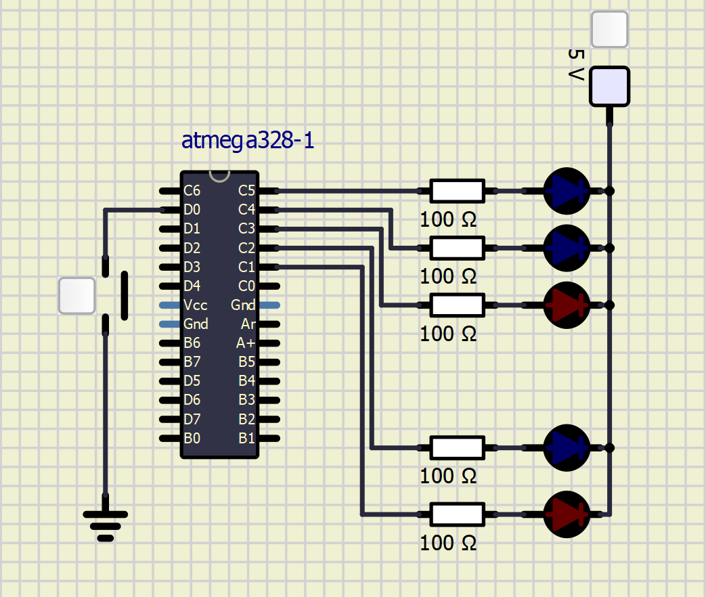

# Lab 3: François Soulié

Link to your `Digital-electronics-2` GitHub repository:

[https://github.com/francois07/digital-electronics-2](https://github.com/francois07/digital-electronics-2)

### Data types in C

1. Complete table.

| **Data type** | **Number of bits** |        **Range**         | **Description**                 |
| :-----------: | :----------------: | :----------------------: | :------------------------------ |
|   `uint8_t`   |         8          |      0, 1, ..., 255      | Unsigned 8-bit integer          |
|   `int8_t`    |         8          |      -128, ..., 127      | Signed 8-bit integer            |
|  `uint16_t`   |         16         |      0, ..., 2^16-1      | Unsigned 16-bit integer         |
|   `int16_t`   |         16         |   -2e+15, ..., 2e+15-1   | Signed 16-bit integer           |
|    `float`    |         32         | -3.4e+38, ..., 3.4e+38-1 | Single-precision floating-point |
|    `void`     |         0          |           None           | No value                        |

### GPIO library

1. In your words, describe the difference between the declaration and the definition of the function in C.

   - Function declaration
   - Function definition

The function declaration indicates to the compiler that this function exists and the function definition tells the compiler what to do when it is called.

2. Part of the C code listing with syntax highlighting, which toggles LEDs only if push button is pressed. Otherwise, the value of the LEDs does not change. Use function from your GPIO library. Let the push button is connected to port D:

```c
    // Configure Push button at port D and enable internal pull-up resistor
    // WRITE YOUR CODE HERE

    // Infinite loop
    // Configure green LED as output
    GPIO_config_output(&DDRB, LED_GREEN);
    GPIO_write_low(&PORTB, LED_GREEN);

    // Configure Push button at port D and enable internal pull-up resistor
    GPIO_config_input_pullup(&DDRD, BTN);

    // Infinite loop
    while (1)
    {
        if(!(GPIO_read(&PIND, BTN) == 1))
        {
            GPIO_toggle(&PORTB, LED_GREEN);
            _delay_ms(1000);
        }
    }
```

### Traffic light

1. Scheme of traffic light application with one red/yellow/green light for cars and one red/green light for pedestrians. Connect AVR device, LEDs, resistors, one push button (for pedestrians), and supply voltage. The image can be drawn on a computer or by hand. Always name all components and their values!

   
